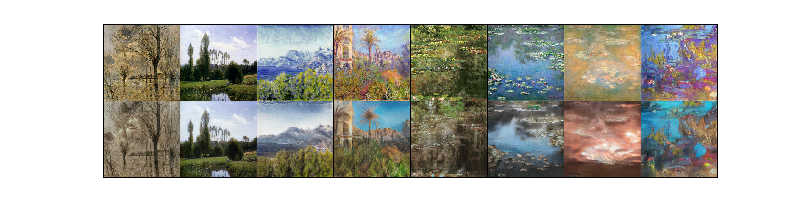
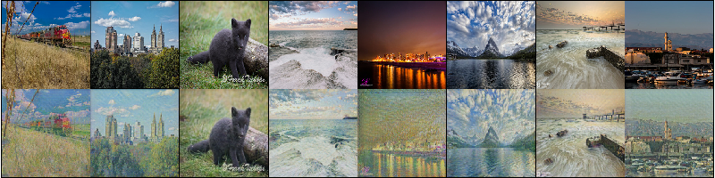

# CycleGAN

#### Title
[Unpaired Image-to-Image Translation using Cycle-Consistent Adversarial Networks](https://arxiv.org/abs/1703.10593)

#### Abstract
Image-to-image translation is a class of vision and graphics problems where the goal is to learn the mapping between an input image and an output image using a training set of aligned image pairs. However, for many tasks, paired training data will not be available. We present an approach for learning to translate an image from a source domain X to a target domain Y in the absence of paired examples. Our goal is to learn a mapping G:X→Y such that the distribution of images from G(X) is indistinguishable from the distribution Y using an adversarial loss. Because this mapping is highly under-constrained, we couple it with an inverse mapping F:Y→X and introduce a cycle consistency loss to push F(G(X))≈X (and vice versa). Qualitative results are presented on several tasks where paired training data does not exist, including collection style transfer, object transfiguration, season transfer, photo enhancement, etc. Quantitative comparisons against several prior methods demonstrate the superiority of our approach.

        
## Train
    $ python main.py --mode train \
                     --scope [scope name] \
                     --name_data [data name] \
                     --dir_data [data directory] \
                     --dir_log [log directory] \
                     --dir_checkpoint [checkpoint directory]
                     --gpu_ids [gpu id; '-1': no gpu, '0, 1, ..., N-1': gpus]
---
    $ python main.py --mode train \
                     --scope cyclegan \
                     --name_data monet2photo \
                     --dir_data ./datasets \
                     --dir_log ./log \
                     --dir_checkpoint ./checkpoint
                     --gpu_ids 0

* Set **[scope name]** uniquely.
* To understand hierarchy of directories based on their arguments, see **directories structure** below. 
* Hyperparameters were written to **arg.txt** under the **[log directory]**.

## Test
    $ python main.py --mode test \
                     --scope [scope name] \
                     --name_data [data name] \
                     --dir_data [data directory] \
                     --dir_log [log directory] \
                     --dir_checkpoint [checkpoint directory] \
                     --dir_result [result directory]
                     --gpu_ids [gpu id; '-1': no gpu, '0, 1, ..., N-1': gpus]
---
    $ python main.py --mode test \
                     --scope cyclegan \
                     --name_data monet2photo \
                     --dir_data ./datasets \
                     --dir_log ./log \
                     --dir_checkpoint ./checkpoints \
                     --dir_result ./results
                     --gpu_ids 0

* To test using trained network, set **[scope name]** defined in the **train** phase.
* Generated images are saved in the **images** subfolder along with **[result directory]** folder.
* **index.html** is also generated to display the generated images.  

## Tensorboard
    $ tensorboard --logdir [log directory]/[scope name]/[data name] \
                  --port [(optional) 4 digit port number]
---
    $ tensorboard --logdir ./log/cyclegan/monet2photo \
                  --port 6006
                  
After the above comment executes, go **http://localhost:6006**

* You can change **[(optional) 4 digit port number]**.
* Default 4 digit port number is **6006**.

## Results

    1st row: input-monet (domain A)
    2nd row: output-photo (domain B)

    1st row: input-photo (domain B)
    2nd row: output-monet (domain A)

* The results were generated by a network trained with **monet2photo** dataset during **260 epochs**.
* After the Test phase runs, execute **display_result.py** to display the figure.

## Directories structure
    pytorch-CycleGAN
    +---[dir_checkpoint]
    |   \---[scope]
    |       \---[name_data]
    |           +---model_epoch00000.pth
    |           |   ...
    |           \---model_epoch12345.pth
    +---[dir_data]
    |   \---[name_data]
    |       +---testA
    |       |   +---00000.png
    |       |   |   ...
    |       |   \---12345.png
    |       +---testB
    |       |   +---00000.png
    |       |   |   ...
    |       |   \---12345.png
    |       +---trainA
    |       |   +---00000.png
    |       |   |   ...
    |       |   \---12345.png
    |       \---trainB
    |           +---00000.png
    |           |   ...
    |           \---12345.png
    +---[dir_log]
    |   \---[scope]
    |       \---[name_data]
    |           +---arg.txt
    |           \---events.out.tfevents
    \---[dir_result]
        \---[scope]
            \---[name_data]
                +---images
                |   +---00000-input_a.png
                |   +---00000-input_b.png
                |   +---00000-output_a.png
                |   +---00000-output_b.png
                |   +---00000-recon_a.png
                |   +---00000-recon_b.png
                |   |   ...
                |   +---12345-input_a.png
                |   +---12345-input_b.png
                |   +---12345-output_a.png
                |   +---12345-output_b.png
                |   +---12345-recon_a.png
                |   +---12345-recon_b.png
                \---index.html

---

    pytorch-CycleGAN
    +---checkpoints
    |   \---cyclegan
    |       \---monet2photo
    |           +---model_epoch0000.pth
    |           |   ...
    |           \---model_epoch0260.pth
    +---datasets
    |   \---monet2photo
    |       +---testA
    |       |   +---00010.jpg
    |       |   |   ...
    |       |   \---01330.jpg
    |       +---testB
    |       |   +---2014-08-01 17_41_55.jpg
    |       |   |   ...
    |       |   \---2015-04-30 23_43_35.jpg
    |       +---trainA
    |       |   +---00001.jpg
    |       |   |   ...
    |       |   \---01337.jpg
    |       \---trainB
    |           +---2013-11-08 16_45_24.jpg
    |           |   ...
    |           \---2017-01-03 09_45_13.jpg
    +---log
    |   \---cyclegan
    |       \---monet2photo
    |           +---arg.txt
    |           \---events.out.tfevents
    \---results
        \---cyclegan
            \---monet2photo
                +---images
                |   +---0000-input_a.png
                |   +---0000-input_b.png
                |   +---0000-output_a.png
                |   +---0000-output_b.png
                |   +---0000-recon_a.png
                |   +---0000-recon_b.png
                |   |   ...
                |   +---0120-input_a.png
                |   +---0120-input_b.png
                |   +---0120-output_a.png
                |   +---0120-output_b.png
                |   +---0120-recon_a.png
                |   +---0120-recon_b.png
                \---index.html
 
* Above directory is created by setting arguments when **main.py** is executed.               
        